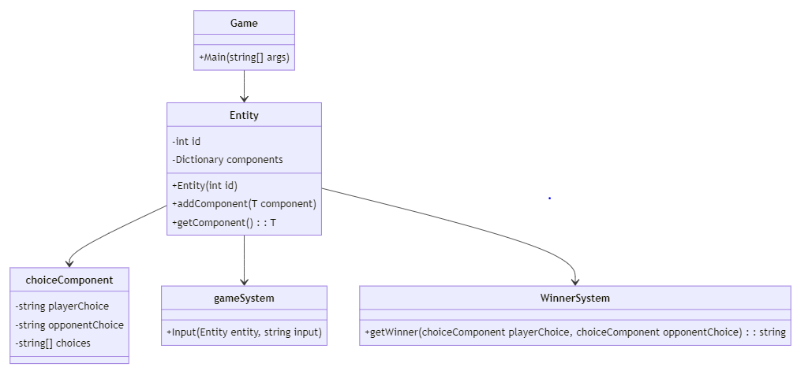

# Developer Documentation for Rock-Paper-Scissors Game

## Introduction
This developer documentation provides insights into the implementation of a Rock-Paper-Scissors (RPS) game structured under the Entity Component System (ECS) paradigm. The ECS architecture is employed to enhance modularity, flexibility, and scalability within the game's design.

## Technical Specifications and Design
- **Entities:** The game revolves around two main entities, the player and the opponent, each represented as an instance of the `Entity` class.
- **Components:** The primary components include the `ChoiceComponent`, responsible for managing player and opponent choices.
- **Systems:** Two key systems are utilized: the `GameSystem`, handling player input, and the `WinnerSystem`, determining the winner based on choices made.

**System Architecture of the Rock-Paper-Scissors Game**

**Flowchart of the Game Loop**

## Implementation Overview
- **Entity Class:** Defines the basic structure of entities and facilitates the addition and retrieval of components.
- **Choice Component:** Manages player and opponent choices, allowing for interaction with the game.
- **Game System:** Handles user input, ensuring valid choices and updating the player's choice component accordingly.
- **Winner System:** Determines the winner based on the choices made by the player and the opponent.

## Development Guidelines and Standards
- **ECS Adherence:** Ensure adherence to the ECS architecture to maintain consistency and scalability.
- **Modularity:** Emphasize modularity in component and system design to facilitate easy integration of new features.
- **Code Quality:** Follow best practices for code readability, maintainability, and efficiency.

## Testing Framework
- **Unit Testing:** Focus on testing individual components and systems to ensure functionality and integrity.
- **Integration Testing:** Evaluate the interaction between systems to verify overall game behavior.

## Version Information
- **Game Version:** 1.0.0
- **Language and Framework:** Developed in C# with .NET framework.

## Performance Metrics and Optimization
- Optimize loop iterations and minimize object creation for improved performance.
- Monitor key metrics such as FPS and memory usage to identify areas for optimization.

## Accessibility Features
- User-friendly interface with clear instructions and feedback.
- Customizable controls for enhanced accessibility.

## Troubleshooting and FAQs
- **Game Initialization:** Verify dependencies and resolve any syntax errors encountered during startup.
- **Rendering Issues:** Ensure correct installation of required components and drivers for smooth rendering.

