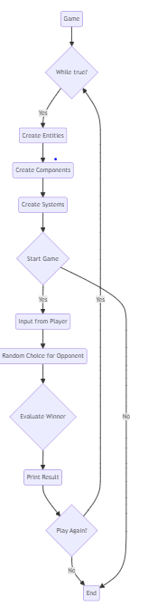

### User Documentation for RPS Game

#### Introduction
Welcome to the Rock-Paper-Scissors (RPS) game! This simple yet engaging game allows you to challenge an opponent in a classic showdown of choices.

#### Getting Started
To begin playing:
1. Run the game executable.
2. Follow the prompts to select your choice: rock, paper, or scissors.
3. Await your opponent's choice.
4. Discover the outcome and enjoy the thrill of victory or the lessons of defeat!

#### Controls
- Use the keyboard to input your choice: "rock", "paper", or "scissors".
- Follow on-screen instructions for additional actions, such as playing another round.

#### Rules
- Rock beats scissors, scissors beat paper, and paper beats rock.
- If both players make the same choice, the round ends in a tie.

#### Tips
- Anticipate your opponent's moves to gain an edge.
- Experiment with different strategies to maximize your chances of winning.

#### Troubleshooting
If you encounter any issues during gameplay, refer to the troubleshooting section in the developer documentation for guidance.

#### Enjoy the Game!
Thank you for choosing to play the RPS game. Have fun and may the best strategist win!

